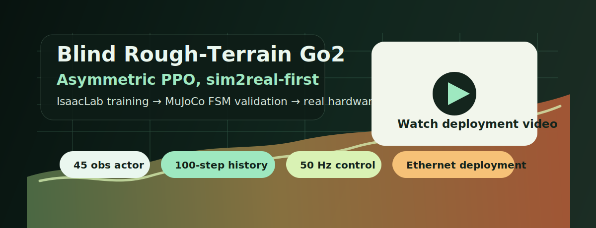

# Go2 Lab Rough Terrain Locomotion

<p align="center">
  <a href="https://www.youtube.com/watch?v=oOYZdeQDaec">
    
  </a>
</p>

<p align="center">
  <a href="https://www.youtube.com/watch?v=oOYZdeQDaec"><strong>Watch the real Go2 deployment video</strong></a>
</p>

Clean public release of the successful Unitree Go2 blind rough-terrain
locomotion path.

This repo intentionally publishes one active line:

- flat MJLAB-contract warmstart prior
- blind rough-terrain asymmetric PPO policy
- deployable actor observations only at runtime
- privileged critic observations only during training
- MuJoCo/Unitree FSM validation before real hardware

Older experimental branches and adaptation experiments are not part of this
public surface.

## Core Idea

The final policy is an asymmetric PPO policy:

- actor: deployable blind proprioception plus action history
- critic: actor observations plus privileged terrain and dynamics signals
- output: 12 joint-position actions
- runtime: no base linear velocity, no terrain scan, no dynamics privilege

The branch was kept simple because the goal was sim2real robustness, not a large
research zoo.

## Quickstart

Expected local layout:

```text
workspace/
  IsaacLab/
  go2-lab-rough-terrain-locomotion/
```

Install:

```bash
export ISAACLAB_ROOT=/path/to/IsaacLab

cd go2-lab-rough-terrain-locomotion
$ISAACLAB_ROOT/_isaac_sim/python.sh -m pip install --user --no-deps -e .
```

This repo vendors the Go2 USD asset used for the reported AsymPPO candidate:

```text
assets/robots/go2/go2.usd
```

By default, training uses that bundled asset. You only need `GO2_USD_PATH` if
you intentionally want to train with a different Go2 USD.

The bundled/default asset contract is:

```text
base body: base
foot/contact bodies: .*_foot
height scanner prim: {ENV_REGEX_NS}/Robot/base
```

If you override `GO2_USD_PATH` with a USD that uses `base_link` and has no
separate `*_foot` bodies, use the calf links as contact bodies:

```bash
export GO2_USD_PATH=/path/to/custom/go2.usd
export GO2_BASE_BODY_NAME=base_link
export GO2_FOOT_BODY_REGEX='.*_calf'
export GO2_HEIGHT_SCANNER_PRIM='{ENV_REGEX_NS}/Robot/base_link'
```

Do not install this package with dependency resolution enabled inside the Isaac
Sim Python. IsaacLab already provides the compatible `torch`, CUDA and
`gymnasium` stack. Installing this repo with normal dependency resolution can
pull a different PyTorch/NCCL build into `~/.local` and break IsaacLab imports.

Check task registration:

```bash
bash scripts/isaaclab_user.sh -p scripts/doctor_isaaclab.py
bash scripts/isaaclab_user.sh -p scripts/check_tasks.py
```

Train the flat prior:

```bash
bash scripts/isaaclab_user.sh -p scripts/train_flat_prior.py \
  --headless \
  --log-dir ~/isaaclab_logs/go2_flat_mjlab_prior_v1
```

Train the rough AsymPPO policy, optionally warm-started from the flat prior:

```bash
bash scripts/isaaclab_user.sh -p scripts/train_asymppo.py \
  --flat-prior-checkpoint /path/to/flat_prior_checkpoint.pt \
  --headless \
  --log-dir ~/isaaclab_logs/go2_blind_rough_asymppo_mjlab_v1
```

There should be no standalone `/` between arguments.

Use `scripts/isaaclab_user.sh` instead of calling `isaaclab.sh` directly on
shared `/opt` IsaacLab installs. The wrapper keeps Kit cache/log/temp files
inside the current user's home directory and exposes Isaac Sim's bundled CUDA
library folders so `torch` can find libraries such as `libcusparseLt.so.0`.

## Active Tasks

```text
Go2-Flat-MJLAB-Prior-V1
Go2-Blind-Rough-MJLAB-AsymPPO-V1
```

## Runtime Contract

The deployable actor consumes:

```text
policy_obs          45
policy_history    4500
history_length     100
control_dt        0.02 s
```

Actor observation order:

```text
base_ang_vel          3
projected_gravity    3
velocity_commands    3
joint_pos_rel       12
joint_vel_rel       12
last_action         12
```

Joint position action:

```text
target = default_joint_pos + 0.25 * action
```

Nominal deployment gains:

```text
kp = 25.0
kd = 0.5
```

## Deployment Validation

The intended path is:

1. Train in IsaacLab.
2. Export a deployment bundle.
3. Validate inference parity.
4. Run MuJoCo/Unitree FSM sim2sim.
5. Run read-only DDS probe on the robot.
6. Run hardware over Ethernet first.

See [docs/DEPLOYMENT.md](docs/DEPLOYMENT.md).

## Demo Media

The top banner links to the real hardware deployment video. The public media
lane should show the active AsymPPO/MuJoCo path only. Do not reuse media from
older experimental branches under this repo.

If a clip is added, place it under:

```text
assets/clips/
assets/thumbs/
```

## Documentation

- [docs/ARCHITECTURE.md](docs/ARCHITECTURE.md)
- [docs/TRAINING.md](docs/TRAINING.md)
- [docs/DEPLOYMENT.md](docs/DEPLOYMENT.md)
- [docs/VALIDATION.md](docs/VALIDATION.md)
- [docs/LIMITATIONS.md](docs/LIMITATIONS.md)
